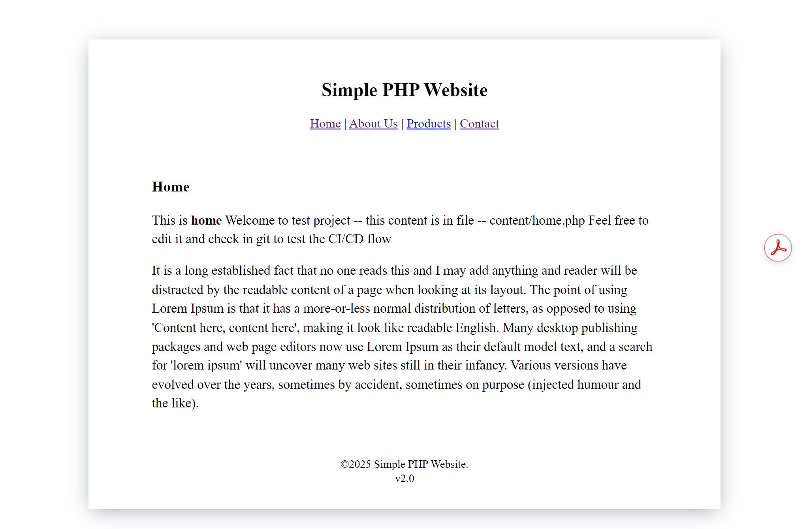

AppleBite - PHP Web Application Deployment Project
Project Overview

AppleBite is a sample PHP-based web application demonstrating CI/CD automation using Jenkins, Docker, and Ansible. The project showcases containerized deployment to a test server with automated build and deployment pipelines.

Key Highlights

CI/CD pipeline implemented in Jenkins.

Docker containerization of the PHP web application.

Automated server setup and Docker installation using Ansible.

Deployment to test and prod servers with Jenkins pipeline.

Environment set up in WSL Ubuntu without using personal device storage.

Repository Structure
AppleBite/
├── Jenkinsfile             # Jenkins pipeline definition
├── Dockerfile              # Dockerfile to build PHP web app image
├── website/                # PHP website code
├── ansible/                # Ansible playbooks for Docker installation
│   └── install-docker.yml
├── inventory_test           # Test server inventory for Ansible
└── README.md

Prerequisites

Docker installed on Jenkins host (pipeline can handle this for remote server).

Jenkins installed and configured with Git credentials.

Ansible installed for server provisioning.

WSL Ubuntu environment (no personal device storage used).

CI/CD Pipeline (Jenkins)

The pipeline performs the following tasks:

Checkout SCM - Fetch latest code from GitHub repository.

Install Puppet Agent (optional) on the test server.

Install Docker via Ansible on the test server.

Build Docker Image from Dockerfile.

Deploy to Test Server - Run the PHP web app container.

Deploy to Prod Server - Optional, runs only if PROD_SERVER parameter is set.

Clean Up Old Containers automatically after deployment.

Docker Image

The project builds a Docker image named:

myphpapp:latest

Run Container Locally (Optional)

To run the PHP web app on your local machine (for testing):

docker run -d -p 80:80 --name php-webapp myphpapp:latest

Note: Deployment to test/prod servers is handled automatically by Jenkins pipeline.

WSL Environment

Entire project and pipelines are executed in WSL Ubuntu environment.

Personal device storage is not used, all files reside in WSL virtual disk.

How to Use

Clone the repository:

git clone https://github.com/triptipnd/AppleBite.git
cd AppleBite

Configure Jenkins with the repository and pipeline.

Set the PROD_SERVER parameter (if required) in Jenkins.

Trigger the pipeline – it will handle build and deployment automatically.

## Screenshots

### Homepage

## Screenshots

### Docker runing

### Jenkins Pipeline

